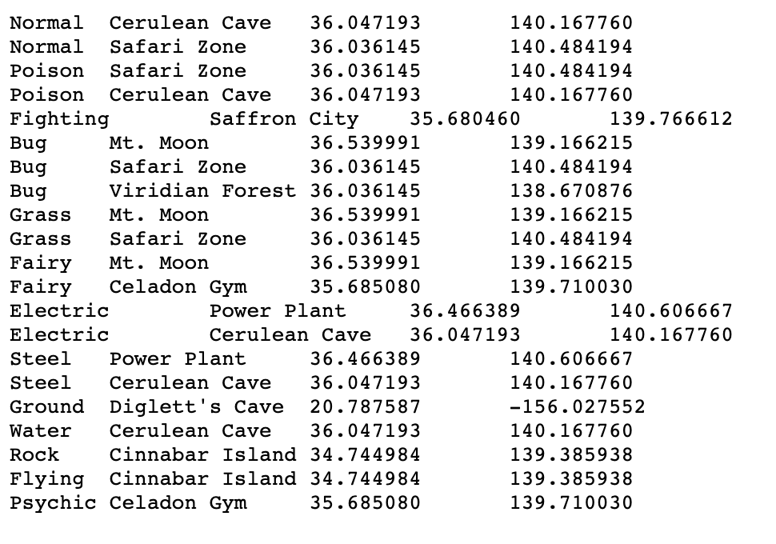

# QGIS Exercise One
With this assignment, you’ll be working with the [Pokemon Map Project](http://pokemon.newtfire.org)  to create a map in QGIS that shows where certain Pokemon types are located. 

It has been theorized that the Pokemon region of Kanto corresponds to the Japanese locale of the same name. Using [this source,](https://bulbapedia.bulbagarden.net/wiki/Pokémon_world_in_relation_to_the_real_world) we manually inserted some geocoordinates into some of the preexisting Pokemon XML files, which enables the locations, the landmark elements, to be placed on a QGIS map. The goal of this assignment is to use that collection of XML files with geocoordinates to create a map of where certain Pokemon types would exist in the real world. 

## Collecting the Data 
A collection of carefully curated XML files from the Pokemon Map Project is in [eXide](http://newtfire.org:8338/exist/apps/eXide/index.html), in '_db/2020_ClassExamples/pokemonQGIS/'. Your first task is to write an XQuery script that runs over that collection and creates a TSV that can be used to create a text-delimited layer in QGIS. 

Open one of the Pokemon files in that collection and think about in particular how you’d access the Pokemon type name, the name of the landmark, the `lat`attribute, and the `lon` attribute with XPath. More specifically, you’re going to want to find the Pokemon type, find the locations associated with that type, and then find the latitude and longitude coordinates associated with each of the locations. 

You’ll want your output to look like the following image. 

As you can see, the first column of the result TSV contains the Pokemon type, the second contains the name of the location, the third contains the latitude coordinate, and the fourth contains the longitude coordinate. 

Hint: You’ve already done the bulk of the work needed to produce this TSV in completing the XQuery 2 assignment. To access the latitude and longitude coordinates, you’ll need another for loop: one that iterates through the distinct landmark values. In that for loop, you can then navigate down to the `lat` attribute that matches up with both the type iterating variable and the landmark iterating value. You’ll need to use two predicates. Then, you can use a very similar line of code to access the `lon` attribute. Finally, be sure to take only the distinct values of the `lat` and `lon` attributes because there are duplicate values for those. 

Be sure to output your XQuery as a TSV file (or a CSV file, if you’re feeling bold), and then save it to your computer. 

## Making the Map 
### Using QGIS Plugins 
In the QGIS Tutorial, we used the OpenStreetMap XYZ Tile Layer as a base map. In that tutorial, we focused on making a map of California; however, you may have noticed, if you navigated to other countries on the map, that the labels for those countries used the languages spoken in those places. The labels on the Japanese portion of the map, for example, are in Japanese. 

Unfortunately, since that layer is owned by OpenStreetMaps, there isn’t a way for us to alter that. As such, for this assignment we’ll need to install a QGIS Plugin to access alternate base maps. 

To install a plugin, navigate to the “Plugins” section of the top ribbon, then click “Manage and Install Plugins” in the resulting dropdown menu. 

You’ll then be presented with the Plugins window. The plugin that we want to install is called “QuickMapServices,” so click on “All” in the menu on the left-hand side of the window, and then search for “QuickMapServices” in the search bar. Click on the result in the menu below the search bar, and then click on “Install Plugin” on the bottom right-hand corner of the window.

After the Plugin has installed and you have closed the Plugins window, you should then notice that there are extra icons in the top menu bar. 

Click on the tiled Earth icon with a plus sign on the bottom right to show the menu of all available services. 

Hover over the “Google” option, and then click on the “Google Road” option. This is a XYZ Tile layer provided by Google, and all of its labels all over the world are in English. 

You should then notice that there is a layer called “Google Road” in the Layer list on the lower left-hand side of the main QGIS window. 

### Adding the Pokemon Delimited Text Layer
Next, you’ll want to add the Pokemon TSV that you created with XQuery as a delimited text layer to your QGIS project. To do that, follow the steps outlined for adding a delimited text layer in the QGIS introductory tutorial. 

If you created a TSV file, you’ll need to change a couple of options when you’re importing the file. Make sure that you select “Custom Delimiters” and make sure that the box next to “Tab” is checked. Furthermore, note that the top row of the TSV file you created does not have the names of the columns; if your TSV looks like the example picture above, then the first row should just contain relevant data. As such, you’ll need to ensure that the box next to “First record has field names” is deselected. Finally, also if your TSV looks like the example above, the X Field will be “field_4” and the Y Field will be “field_3”. If you remember, the Y coordinates are the latitude coordinates, while the X coordinates are the longitude coordinates. 

Your QGIS map, zoomed out, should now look something like the following image. 

Notice that not all of the locations are in Japan: one is in France, and another is in Hawaii. This is because some of the Pokemon XML files in that collection reference locations that are supposed to be in Hawaii and France; it does not appear that the original creators of the Pokemon Map Project restricted themselves to the Kanto region. However, the map that we want to create will focus on Japan. 

Zoom in on the points clustered in Japan. Your map should look something like the image below. 

### Changing Point Colors According to Type 

First, look again at the data in the TSV that makes up the delimited text layer. To do that, right click on the Pokemon delimited text layer, and then select “Open Attribute Table” in the resulting menu. 

You can see that there are 21 separate rows for 21 separate locations, but there are only 13 distinct types in this list. We’re going to change the color of the points for each of these types using “Case” statements. 

Close the attribute table window and right click on the Pokemon delimited text layer again, this time selecting “Properties” from the resulting menu. 

The “Layer Properties” window should then appear. Select “Symbology” from the menu on the left-hand side of the window, and then click on the “Simple Marker” symbol from underneath “Marker. These are the options that determine what the points currently on the map look like. You can see that the color that the points are on the map corresponds to the color in the box next to “Fill color.” If we wanted to change the color for all of the points on the map, then we’d change the color in that box. However, we want to change the colors of all of the points on the map according to the Pokemon types with which they are associated, and so we need to create some expressions. To do that, click on the gray square on the far right hand side of the window, next to the “Fill Color” box, and underlined in red in the image below. 

Under the “Expression” section of the menu, click on “Edit…” to edit an expression that governs how the colors of the points should be adjudicated. 

#### Case Statements in QGIS

A case statement is like an “If, then” statement, only it’s more convenient to write when you have numerous conditions that you want to test for. 

With an If, then statement, you want to test to see if a condition returns true. If it does return true, then you want something to happen. 

An example, in pseudocode: 
If 3>0, then print “3 is positive”. 

Here, the condition that we want to test is if 3 is greater than 0. It is greater than zero, and so, if this were a statement in a programming language like Python or Java, the statement “3 is positive” would be printed. 

If -4 > 0, then print “-4 is positive” would not print out “-4 is positive”, because -4 is not greater than zero. 

A case statement in QGIS works in a similar manner. 

It’s set up like this: 

CASE 
	WHEN condition THEN result 
	WHEN condition THEN result 
	.
	.
	.
END 

With this, WHEN a condition is true THEN a result shall occur. 

You use CASE and END to bracket all of the accompanying WHEN statements so that QGIS is able to recognize them for what they are: multiple cases that could be true. 

#### Using Case Statements to Change Point Colors 

After clicking “Edit…”, the Expression String Builder window should open. It should look something like the image below. 

In the blank white space on the left hand side of the window is where you will be writing the case statement. The middle column, though the white background on my image makes it very hard to see, contains the different functions that one can use to build an expression. Finally, the column on the right contains explanations for each function. 

Essentially, we want to use a case statement like this: 

CASE 
	WHEN type = ELECTRIC then color is yellow 
END

In other words, the case when the Pokemon type is equal to ‘ELECTRIC’ should result in the color of the point being yellow. 

What syntax do we need to use to make this happen? 

First, we should remember that the first column, “field_1”, is what stores the Pokemon type names. To reference a column, you use double quotes; to represent a string value in a column, you use single quotes. 
As such, 

`WHEN “field_1” = ‘ELECTRIC’ then color is yellow`

would be the first part of the WHEN statement that we eventually want to produce. 

Second, to change the color of a point, we use the function `rgb(_, _, _)`.  This function uses the rgb value of a color, or the amount of red, green, and blue that any given color is made of. The first argument of the `rgb` function contains a number from 0-255, which indicates the amount of red that the resulting color should have, the second argument also takes a number from 0-255, which indicates the amount of green that the resulting color should have, and the third argument takes a number from 0-255 that indicates the amount of blue that the resulting color should have. 

If you go to [HTML Color Picker](https://www.w3schools.com/colors/colors_picker.asp), you can use the color wheel to choose a color and then find out the different ways in which that color can be represented. You can find out the rgb values for a color using this tool, indicated by the value underlined in red in the picture below. 

Now we know what the full WHEN statement should look like: 

  `WHEN “field_1” = ‘ELECTRIC’ then rgb(255,255,0)`

Use the HTML Color Picker to select colors for each of the different types, and then write a CASE statement to change the point color when the value of “field_1” are all of the different types. You can either type the expression into the window or click on the different functions in the middle list to compose the expression. 

It should end up looking like the expression pictured below. 

When you’re finished, click “OK.” 

The main QGIS map should now look something like this, depending on the different colors that you chose: 

You can see that now there are different colors for different Pokemon types. 

### Finishing Touches 

As explained in the introductory QGIS tutorial, use Print Layout to create a nice picture of your map, adding perhaps a label or even an explanation for the different type colors. 

### Submitting Your Exercise 

When you’re finished, upload __________ (a picture of the map or the QGIS project itself?) to Canvas. 